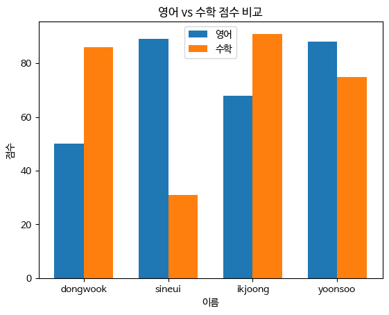

## 데이터 분석을 위한 라이브러리, 판다스를 가져온다.


```python
import pandas as pd
```

## 이어서 해본다... **Dataframe**을 만들어보고 실습해보자.


```python
two_dimensional_list = [['dongwook',50,86],['sineui',89,31],['ikjoong',68,91],['yoonsoo',88,75]]
```


```python
# 이제 데이터 프레임이 출력될까?
my_df = pd.DataFrame(two_dimensional_list)
my_df
```


<div>
<style scoped>
    .dataframe tbody tr th:only-of-type {
        vertical-align: middle;
    }

    .dataframe tbody tr th {
        vertical-align: top;
    }

    .dataframe thead th {
        text-align: right;
    }
</style>
<table border="1" class="dataframe">
  <thead>
    <tr style="text-align: right;">
      <th></th>
      <th>0</th>
      <th>1</th>
      <th>2</th>
    </tr>
  </thead>
  <tbody>
    <tr>
      <th>0</th>
      <td>dongwook</td>
      <td>50</td>
      <td>86</td>
    </tr>
    <tr>
      <th>1</th>
      <td>sineui</td>
      <td>89</td>
      <td>31</td>
    </tr>
    <tr>
      <th>2</th>
      <td>ikjoong</td>
      <td>68</td>
      <td>91</td>
    </tr>
    <tr>
      <th>3</th>
      <td>yoonsoo</td>
      <td>88</td>
      <td>75</td>
    </tr>
  </tbody>
</table>
</div>


## **20260318wed_start**


```python
two_dimensional_list # 간단히 Raw 상태를 보기
```


    [['dongwook', 50, 86],
     ['sineui', 89, 31],
     ['ikjoong', 68, 91],
     ['yoonsoo', 88, 75]]


```python
my_df = pd.DataFrame(two_dimensional_list) # my_df 변수에 앞서서 한거 넣기. 데이터 프레임으로 보기 위함.
my_df
```


<div>
<style scoped>
    .dataframe tbody tr th:only-of-type {
        vertical-align: middle;
    }

    .dataframe tbody tr th {
        vertical-align: top;
    }

    .dataframe thead th {
        text-align: right;
    }
</style>
<table border="1" class="dataframe">
  <thead>
    <tr style="text-align: right;">
      <th></th>
      <th>0</th>
      <th>1</th>
      <th>2</th>
    </tr>
  </thead>
  <tbody>
    <tr>
      <th>0</th>
      <td>dongwook</td>
      <td>50</td>
      <td>86</td>
    </tr>
    <tr>
      <th>1</th>
      <td>sineui</td>
      <td>89</td>
      <td>31</td>
    </tr>
    <tr>
      <th>2</th>
      <td>ikjoong</td>
      <td>68</td>
      <td>91</td>
    </tr>
    <tr>
      <th>3</th>
      <td>yoonsoo</td>
      <td>88</td>
      <td>75</td>
    </tr>
  </tbody>
</table>
</div>


### 위는 4행 3열이다.


```python
type(two_dimensional_list)
```


    list


### 자료형은 리스트다.


```python
type(my_df)
```


    pandas.core.frame.DataFrame


### 판다스 코어라는 것을 보여준다...

행 번호 = INDEX


```python
my_df = pd.DataFrame(two_dimensional_list, columns=['name','english_score','math_score'])
my_df
```


<div>
<style scoped>
    .dataframe tbody tr th:only-of-type {
        vertical-align: middle;
    }

    .dataframe tbody tr th {
        vertical-align: top;
    }

    .dataframe thead th {
        text-align: right;
    }
</style>
<table border="1" class="dataframe">
  <thead>
    <tr style="text-align: right;">
      <th></th>
      <th>name</th>
      <th>english_score</th>
      <th>math_score</th>
    </tr>
  </thead>
  <tbody>
    <tr>
      <th>0</th>
      <td>dongwook</td>
      <td>50</td>
      <td>86</td>
    </tr>
    <tr>
      <th>1</th>
      <td>sineui</td>
      <td>89</td>
      <td>31</td>
    </tr>
    <tr>
      <th>2</th>
      <td>ikjoong</td>
      <td>68</td>
      <td>91</td>
    </tr>
    <tr>
      <th>3</th>
      <td>yoonsoo</td>
      <td>88</td>
      <td>75</td>
    </tr>
  </tbody>
</table>
</div>


#### 반드시 데이터 프레임의 **컬럼을 다 넣어야** 한다. 컬럼 제목을 직접 정의한다.


```python
my_df = pd.DataFrame(two_dimensional_list, columns=['name','english_score','math_score'], index=['a','b','c','d'])
my_df
```


<div>
<style scoped>
    .dataframe tbody tr th:only-of-type {
        vertical-align: middle;
    }

    .dataframe tbody tr th {
        vertical-align: top;
    }

    .dataframe thead th {
        text-align: right;
    }
</style>
<table border="1" class="dataframe">
  <thead>
    <tr style="text-align: right;">
      <th></th>
      <th>name</th>
      <th>english_score</th>
      <th>math_score</th>
    </tr>
  </thead>
  <tbody>
    <tr>
      <th>a</th>
      <td>dongwook</td>
      <td>50</td>
      <td>86</td>
    </tr>
    <tr>
      <th>b</th>
      <td>sineui</td>
      <td>89</td>
      <td>31</td>
    </tr>
    <tr>
      <th>c</th>
      <td>ikjoong</td>
      <td>68</td>
      <td>91</td>
    </tr>
    <tr>
      <th>d</th>
      <td>yoonsoo</td>
      <td>88</td>
      <td>75</td>
    </tr>
  </tbody>
</table>
</div>


#### **인덱스 제목도 정의했다.**


```python
my_df.columns
```


    Index(['name', 'english_score', 'math_score'], dtype='object')


### my_df의 컬럼들을 다 볼수 있는 코드(구문)이다.


```python
my_df.index
```


    Index(['a', 'b', 'c', 'd'], dtype='object')


### my_df의 인덱스들을 다 볼수 있는 코드(구문)이다.


```python
my_df.dtypes
```


    name             object
    english_score     int64
    math_score        int64
    dtype: object


### **자료형**들이 뭔지 살펴보기

### **아마 여기까지만 teacher 수업 내용이었을거다. - 2026년 3월 31일에 이 주석 메모 작성함.**


```python

```


```python

```

## 챗GPT와 함께하는 후속 학습 - **맷플롯리브로 시각화하기***!*

### ✅ 1. matplotlib + 폰트 설정


```python
import matplotlib.pyplot as plt
import matplotlib.font_manager as fm

# 폰트 경로 (같은 폴더에 있다고 했으니까) (나눔바른고딕 볼드)
font_path = './NanumBarunGothicBold.ttf'
font_name = fm.FontProperties(fname=font_path).get_name()

plt.rc('font', family=font_name)
```

### ✅ 2. 영어 점수 막대그래프


```python
plt.figure()

plt.bar(my_df['name'], my_df['english_score'])

plt.title('영어 점수')
plt.xlabel('이름')
plt.ylabel('점수')

plt.show()
```


    

    


### ✅ 3. 수학 점수 막대그래프


```python
plt.figure()

plt.bar(my_df['name'], my_df['math_score'])

plt.title('수학 점수')
plt.xlabel('이름')
plt.ylabel('점수')

plt.show()
```


    

    


### ✅ 4. (추천) 한 번에 비교 그래프


```python
import numpy as np

x = np.arange(len(my_df['name']))
width = 0.35

plt.figure()

plt.bar(x - width/2, my_df['english_score'], width, label='영어')
plt.bar(x + width/2, my_df['math_score'], width, label='수학')

plt.xticks(x, my_df['name'])

plt.title('영어 vs 수학 점수 비교')
plt.xlabel('이름')
plt.ylabel('점수')
plt.legend()

plt.show()
```


    

    


### 🔥 **핵심 포인트**
---
#### plt.bar() → 막대그래프
#### plt.xticks() → x축 이름 설정
#### **font_manager → 한글 깨짐 방지 (이거 중요)**

---
## 2026년 3월 25일 수업 시작
---


```python
import pandas as pd
```


```python
singers = [['Taylor Swift','December 13', 'Singer-songwriter'],['Aaron Sorkin','June 9, 1961','Screenwriter'],['Harry Potter','July 31, 1980','Wizard'],['Ji-Sung Park','February 25, 1981','Footballer']]


s_df = pd.DataFrame(singers, columns=['name','birthday','occupation'])
s_df
```


<div>
<style scoped>
    .dataframe tbody tr th:only-of-type {
        vertical-align: middle;
    }

    .dataframe tbody tr th {
        vertical-align: top;
    }

    .dataframe thead th {
        text-align: right;
    }
</style>
<table border="1" class="dataframe">
  <thead>
    <tr style="text-align: right;">
      <th></th>
      <th>name</th>
      <th>birthday</th>
      <th>occupation</th>
    </tr>
  </thead>
  <tbody>
    <tr>
      <th>0</th>
      <td>Taylor Swift</td>
      <td>December 13</td>
      <td>Singer-songwriter</td>
    </tr>
    <tr>
      <th>1</th>
      <td>Aaron Sorkin</td>
      <td>June 9, 1961</td>
      <td>Screenwriter</td>
    </tr>
    <tr>
      <th>2</th>
      <td>Harry Potter</td>
      <td>July 31, 1980</td>
      <td>Wizard</td>
    </tr>
    <tr>
      <th>3</th>
      <td>Ji-Sung Park</td>
      <td>February 25, 1981</td>
      <td>Footballer</td>
    </tr>
  </tbody>
</table>
</div>


### Pandas 데이터프레임 생성 코드 해설

1. **라이브러리 호출**: `import pandas as pd`를 통해 데이터 핸들링 컨벤션인 `pd` 별칭으로 라이브러리를 불러옵니다.
2. **원시 데이터 정의**: `singers` 리스트 내부에 각 행(Row)이 될 리스트들을 담은 **2차원 리스트**를 생성합니다.
3. **구조화**: `pd.DataFrame()` 인스턴스를 생성하며, 두 번째 인자인 `columns`를 통해 데**의 **열 이름(Hea**r)**을 명시적으로 지정합니다.
4. **객체 출력**: 최종 생성된 변수 `s_df`를 호출하여 엑셀과 같은 **표 형식(Tabular data)**으로 데이터를 시각화합니다.


```python
import pandas as pd

# 1. 변수명을 성격에 맞게 변경하고 딕셔너리 구조 사용
data = [
    {'name': 'Taylor Swift', 'birthday': '1989-12-13', 'occupation': 'Singer-songwriter'},
    {'name': 'Aaron Sorkin', 'birthday': '1961-06-09', 'occupation': 'Screenwriter'},
    {'name': 'Ji-Sung Park', 'birthday': '1981-02-25', 'occupation': 'Footballer'},
    {'name': 'Beyoncé',      'birthday': '1981-09-04', 'occupation': 'Singer'}
]

# 2. 데이터프레임 생성
df = pd.DataFrame(data)

# 3. 날짜 컬럼을 datetime 형식으로 변환 (매우 중요!)
df['birthday'] = pd.to_datetime(df['birthday'])

# 확인용 출력
print(df.info()) # 데이터 타입 확인
df
```

    <class 'pandas.core.frame.DataFrame'>
    RangeIndex: 4 entries, 0 to 3
    Data columns (total 3 columns):
     #   Column      Non-Null Count  Dtype         
    ---  ------      --------------  -----         
     0   name        4 non-null      object        
     1   birthday    4 non-null      datetime64[ns]
     2   occupation  4 non-null      object        
    dtypes: datetime64[ns](1), object(2)
    memory usage: 228.0+ bytes
    None
    


<div>
<style scoped>
    .dataframe tbody tr th:only-of-type {
        vertical-align: middle;
    }

    .dataframe tbody tr th {
        vertical-align: top;
    }

    .dataframe thead th {
        text-align: right;
    }
</style>
<table border="1" class="dataframe">
  <thead>
    <tr style="text-align: right;">
      <th></th>
      <th>name</th>
      <th>birthday</th>
      <th>occupation</th>
    </tr>
  </thead>
  <tbody>
    <tr>
      <th>0</th>
      <td>Taylor Swift</td>
      <td>1989-12-13</td>
      <td>Singer-songwriter</td>
    </tr>
    <tr>
      <th>1</th>
      <td>Aaron Sorkin</td>
      <td>1961-06-09</td>
      <td>Screenwriter</td>
    </tr>
    <tr>
      <th>2</th>
      <td>Ji-Sung Park</td>
      <td>1981-02-25</td>
      <td>Footballer</td>
    </tr>
    <tr>
      <th>3</th>
      <td>Beyoncé</td>
      <td>1981-09-04</td>
      <td>Singer</td>
    </tr>
  </tbody>
</table>
</div>


## 1. 데이터 구조의 최적화 (List of Dicts)
* **기존:** `[[], []]` 형태의 리스트 구조는 인덱스 순서에 의존하므로 데이터가 섞일 위험이 큼.
* **개선:** `[{column: value}, ...]` 형태의 **딕셔너리 리스트**를 사용. 
    * 컬럼명이 명시되어 가독성이 높고, 데이터 누락이나 순서 변경에 강함.

## 2. 데이터 타입의 정규화 (Datetime Conversion)
* **문제:** 'December 13'과 같은 문자열은 컴퓨터가 날짜로 인식하지 못해 연산(나이 계산, 정렬)이 불가능함.
* **해결:** `pd.to_datetime()` 함수를 사용하여 날짜 컬럼을 **ISO 8601 형식(YYYY-MM-DD)**으로 표준화.
    * 이를 통해 `df['birthday'].dt.year`와 같은 판다스의 시계열 분석 기능을 활용할 수 있음.

## 3. 변수 명명법 및 데이터 무결성 (Semantics)
* **변수명:** `singers` 대신 데이터의 전체 범위를 포괄하는 `df` 또는 `people_df` 사용.
* **일관성:** 직업군(occupation)에 맞는 실제 인물 데이터를 구성하여 데이터 분석의 논리적 타당성 확보.

## 4. 확장성을 고려한 코드 작성
* 데이터프레임 생성 후 `df.info()`를 통해 데이터 타입을 확인하는 습관은 대규모 데이터 처리 시 오류를 방지하는 좋은 습관임.

### **아니다. 일단 바로 위 코드는 과제였다.**

### 시작. 2026년 03월 31일 오전 9시 17분


```python
import pandas as pd
list = [
    [100,30,10],
    [200,25,11],
    [300,20,12],
    [400,15,13]
]

df = pd.DataFrame(list, columns=['매출액','영업이익','순이익'], index=['1분기','2분기','3분기','4분기'])
df
```


<div>
<style scoped>
    .dataframe tbody tr th:only-of-type {
        vertical-align: middle;
    }

    .dataframe tbody tr th {
        vertical-align: top;
    }

    .dataframe thead th {
        text-align: right;
    }
</style>
<table border="1" class="dataframe">
  <thead>
    <tr style="text-align: right;">
      <th></th>
      <th>매출액</th>
      <th>영업이익</th>
      <th>순이익</th>
    </tr>
  </thead>
  <tbody>
    <tr>
      <th>1분기</th>
      <td>100</td>
      <td>30</td>
      <td>10</td>
    </tr>
    <tr>
      <th>2분기</th>
      <td>200</td>
      <td>25</td>
      <td>11</td>
    </tr>
    <tr>
      <th>3분기</th>
      <td>300</td>
      <td>20</td>
      <td>12</td>
    </tr>
    <tr>
      <th>4분기</th>
      <td>400</td>
      <td>15</td>
      <td>13</td>
    </tr>
  </tbody>
</table>
</div>


## 코드 설명

- 리스트 데이터를 `pandas.DataFrame`으로 변환
- `columns` → 열 이름 지정 (매출액, 영업이익, 순이익)
- `index` → 행 이름 지정 (1~4분기)
- 결과: 분기별 재무 데이터를 표 형태(DataFrame)로 구조화

## 데이터 구조

- 행(row): 각 분기 (1분기 ~ 4분기)
- 열(column): 재무 지표 (매출액, 영업이익, 순이익)
- 값(value): 각 분기의 실제 수치

## 핵심 요약

- 리스트 → DataFrame 변환
- 행/열 이름 지정으로 의미 있는 데이터 구조 생성

---


```python
df.loc['1분기']
```


    매출액     100
    영업이익     30
    순이익      10
    Name: 1분기, dtype: int64


```python
type(df.loc['1분기'])
```


    pandas.core.series.Series


## df.loc['1분기']

- 인덱스가 '1분기'인 행(row) 선택
- 결과: 해당 분기의 데이터 1줄 반환

## type(df.loc['1분기'])

- 반환 타입: pandas Series
- 즉, 한 행(row)은 Series 형태로 반환됨

## 핵심 요약

- `df.loc[행]` → 단일 행 선택
- 결과 타입 → `Series`

---


```python
df.loc[['1분기']]
```


<div>
<style scoped>
    .dataframe tbody tr th:only-of-type {
        vertical-align: middle;
    }

    .dataframe tbody tr th {
        vertical-align: top;
    }

    .dataframe thead th {
        text-align: right;
    }
</style>
<table border="1" class="dataframe">
  <thead>
    <tr style="text-align: right;">
      <th></th>
      <th>매출액</th>
      <th>영업이익</th>
      <th>순이익</th>
    </tr>
  </thead>
  <tbody>
    <tr>
      <th>1분기</th>
      <td>100</td>
      <td>30</td>
      <td>10</td>
    </tr>
  </tbody>
</table>
</div>


## df.loc[['1분기']]

- '1분기'를 리스트로 전달 → 행을 DataFrame 형태로 반환

## 차이

- `df.loc['1분기']` → Series (1행, 1차원)
- `df.loc[['1분기']]` → DataFrame (1행, 2차원)

## 핵심

- 대괄호 하나 더 → 차원 유지 

---(DataFrame)


```python
df.loc[['1분기', '2분기']]
```


<div>
<style scoped>
    .dataframe tbody tr th:only-of-type {
        vertical-align: middle;
    }

    .dataframe tbody tr th {
        vertical-align: top;
    }

    .dataframe thead th {
        text-align: right;
    }
</style>
<table border="1" class="dataframe">
  <thead>
    <tr style="text-align: right;">
      <th></th>
      <th>매출액</th>
      <th>영업이익</th>
      <th>순이익</th>
    </tr>
  </thead>
  <tbody>
    <tr>
      <th>1분기</th>
      <td>100</td>
      <td>30</td>
      <td>10</td>
    </tr>
    <tr>
      <th>2분기</th>
      <td>200</td>
      <td>25</td>
      <td>11</td>
    </tr>
  </tbody>
</table>
</div>


## df.loc[['1분기', '2분기']]

- 여러 행 선택 → '1분기', '2분기' 데이터 반환 (DataFrame)

## 핵심

- 리스트로 여러 인덱스 전달 → 여러 행 선택, 2차원 유지

---


```python
df.index == '2분기'
```


    array([False,  True, False, False])


## df.index == '2분기'

- 인덱스와 '2분기' 비교 → Boolean 배열 생성

## 핵심

- 각 인덱스가 '2분기'인지 True/Fal

array([False,  True, False, False])
---se로 반환


```python
df.index != '2분기'
```


    array([ True, False,  True,  True])


## df.index != '2분기'

- 인덱스와 '2분기'가 아닌 값 비교 → Boolean 배열 생성

## 핵심

- '2분기'가 아닌 인덱스는 True, '2분기'는 False

array([ True, False,  True,  True])
---


```python
df.loc[df.index != '2분기']
```


<div>
<style scoped>
    .dataframe tbody tr th:only-of-type {
        vertical-align: middle;
    }

    .dataframe tbody tr th {
        vertical-align: top;
    }

    .dataframe thead th {
        text-align: right;
    }
</style>
<table border="1" class="dataframe">
  <thead>
    <tr style="text-align: right;">
      <th></th>
      <th>매출액</th>
      <th>영업이익</th>
      <th>순이익</th>
    </tr>
  </thead>
  <tbody>
    <tr>
      <th>1분기</th>
      <td>100</td>
      <td>30</td>
      <td>10</td>
    </tr>
    <tr>
      <th>3분기</th>
      <td>300</td>
      <td>20</td>
      <td>12</td>
    </tr>
    <tr>
      <th>4분기</th>
      <td>400</td>
      <td>15</td>
      <td>13</td>
    </tr>
  </tbody>
</table>
</div>


## df.loc[df.index != '2분기']

- '2분기'를 제외한 모든 행 선택

## 핵심

- Boolean 인덱싱으로 특정->행Dataframe 으로 반환

---ame 반환ame 반환


```python
#1
df.loc[['2분기', '4분기']]
```


<div>
<style scoped>
    .dataframe tbody tr th:only-of-type {
        vertical-align: middle;
    }

    .dataframe tbody tr th {
        vertical-align: top;
    }

    .dataframe thead th {
        text-align: right;
    }
</style>
<table border="1" class="dataframe">
  <thead>
    <tr style="text-align: right;">
      <th></th>
      <th>매출액</th>
      <th>영업이익</th>
      <th>순이익</th>
    </tr>
  </thead>
  <tbody>
    <tr>
      <th>2분기</th>
      <td>200</td>
      <td>25</td>
      <td>11</td>
    </tr>
    <tr>
      <th>4분기</th>
      <td>400</td>
      <td>15</td>
      <td>13</td>
    </tr>
  </tbody>
</table>
</div>


```python
#2
df.loc[[False, True, False, True]]
```


<div>
<style scoped>
    .dataframe tbody tr th:only-of-type {
        vertical-align: middle;
    }

    .dataframe tbody tr th {
        vertical-align: top;
    }

    .dataframe thead th {
        text-align: right;
    }
</style>
<table border="1" class="dataframe">
  <thead>
    <tr style="text-align: right;">
      <th></th>
      <th>매출액</th>
      <th>영업이익</th>
      <th>순이익</th>
    </tr>
  </thead>
  <tbody>
    <tr>
      <th>2분기</th>
      <td>200</td>
      <td>25</td>
      <td>11</td>
    </tr>
    <tr>
      <th>4분기</th>
      <td>400</td>
      <td>15</td>
      <td>13</td>
    </tr>
  </tbody>
</table>
</div>


```python

```
