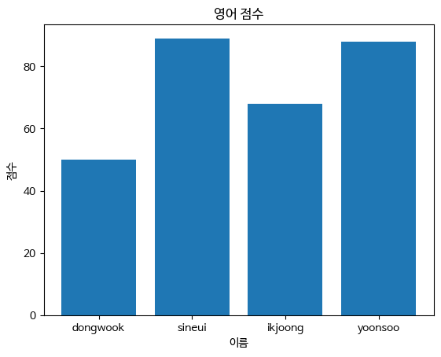
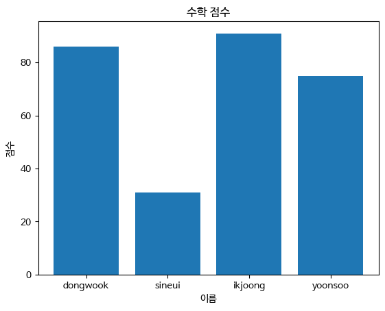

## 데이터 분석을 위한 라이브러리, 판다스를 가져온다.


```python
import pandas as pd
```

## 이어서 해본다... **Dataframe**을 만들어보고 실습해보자.


```python
two_dimensional_list = [['dongwook',50,86],['sineui',89,31],['ikjoong',68,91],['yoonsoo',88,75]]
```


```python
# 이제 데이터 프레임이 출력될까?
my_df = pd.DataFrame(two_dimensional_list)
my_df
```


<div>
<style scoped>
    .dataframe tbody tr th:only-of-type {
        vertical-align: middle;
    }

    .dataframe tbody tr th {
        vertical-align: top;
    }

    .dataframe thead th {
        text-align: right;
    }
</style>
<table border="1" class="dataframe">
  <thead>
    <tr style="text-align: right;">
      <th></th>
      <th>0</th>
      <th>1</th>
      <th>2</th>
    </tr>
  </thead>
  <tbody>
    <tr>
      <th>0</th>
      <td>dongwook</td>
      <td>50</td>
      <td>86</td>
    </tr>
    <tr>
      <th>1</th>
      <td>sineui</td>
      <td>89</td>
      <td>31</td>
    </tr>
    <tr>
      <th>2</th>
      <td>ikjoong</td>
      <td>68</td>
      <td>91</td>
    </tr>
    <tr>
      <th>3</th>
      <td>yoonsoo</td>
      <td>88</td>
      <td>75</td>
    </tr>
  </tbody>
</table>
</div>


## **20260318wed_start**


```python
two_dimensional_list # 간단히 Raw 상태를 보기
```


    [['dongwook', 50, 86],
     ['sineui', 89, 31],
     ['ikjoong', 68, 91],
     ['yoonsoo', 88, 75]]


```python
my_df = pd.DataFrame(two_dimensional_list) # my_df 변수에 앞서서 한거 넣기. 데이터 프레임으로 보기 위함.
my_df
```


<div>
<style scoped>
    .dataframe tbody tr th:only-of-type {
        vertical-align: middle;
    }

    .dataframe tbody tr th {
        vertical-align: top;
    }

    .dataframe thead th {
        text-align: right;
    }
</style>
<table border="1" class="dataframe">
  <thead>
    <tr style="text-align: right;">
      <th></th>
      <th>0</th>
      <th>1</th>
      <th>2</th>
    </tr>
  </thead>
  <tbody>
    <tr>
      <th>0</th>
      <td>dongwook</td>
      <td>50</td>
      <td>86</td>
    </tr>
    <tr>
      <th>1</th>
      <td>sineui</td>
      <td>89</td>
      <td>31</td>
    </tr>
    <tr>
      <th>2</th>
      <td>ikjoong</td>
      <td>68</td>
      <td>91</td>
    </tr>
    <tr>
      <th>3</th>
      <td>yoonsoo</td>
      <td>88</td>
      <td>75</td>
    </tr>
  </tbody>
</table>
</div>


### 위는 4행 3열이다.


```python
type(two_dimensional_list)
```


    list


### 자료형은 리스트다.


```python
type(my_df)
```


    pandas.core.frame.DataFrame


### 판다스 코어라는 것을 보여준다...

행 번호 = INDEX


```python
my_df = pd.DataFrame(two_dimensional_list, columns=['name','english_score','math_score'])
my_df
```


<div>
<style scoped>
    .dataframe tbody tr th:only-of-type {
        vertical-align: middle;
    }

    .dataframe tbody tr th {
        vertical-align: top;
    }

    .dataframe thead th {
        text-align: right;
    }
</style>
<table border="1" class="dataframe">
  <thead>
    <tr style="text-align: right;">
      <th></th>
      <th>name</th>
      <th>english_score</th>
      <th>math_score</th>
    </tr>
  </thead>
  <tbody>
    <tr>
      <th>0</th>
      <td>dongwook</td>
      <td>50</td>
      <td>86</td>
    </tr>
    <tr>
      <th>1</th>
      <td>sineui</td>
      <td>89</td>
      <td>31</td>
    </tr>
    <tr>
      <th>2</th>
      <td>ikjoong</td>
      <td>68</td>
      <td>91</td>
    </tr>
    <tr>
      <th>3</th>
      <td>yoonsoo</td>
      <td>88</td>
      <td>75</td>
    </tr>
  </tbody>
</table>
</div>


#### 반드시 데이터 프레임의 **컬럼을 다 넣어야** 한다. 컬럼 제목을 직접 정의한다.


```python
my_df = pd.DataFrame(two_dimensional_list, columns=['name','english_score','math_score'], index=['a','b','c','d'])
my_df
```


<div>
<style scoped>
    .dataframe tbody tr th:only-of-type {
        vertical-align: middle;
    }

    .dataframe tbody tr th {
        vertical-align: top;
    }

    .dataframe thead th {
        text-align: right;
    }
</style>
<table border="1" class="dataframe">
  <thead>
    <tr style="text-align: right;">
      <th></th>
      <th>name</th>
      <th>english_score</th>
      <th>math_score</th>
    </tr>
  </thead>
  <tbody>
    <tr>
      <th>a</th>
      <td>dongwook</td>
      <td>50</td>
      <td>86</td>
    </tr>
    <tr>
      <th>b</th>
      <td>sineui</td>
      <td>89</td>
      <td>31</td>
    </tr>
    <tr>
      <th>c</th>
      <td>ikjoong</td>
      <td>68</td>
      <td>91</td>
    </tr>
    <tr>
      <th>d</th>
      <td>yoonsoo</td>
      <td>88</td>
      <td>75</td>
    </tr>
  </tbody>
</table>
</div>


#### **인덱스 제목도 정의했다.**


```python
my_df.columns
```


    Index(['name', 'english_score', 'math_score'], dtype='object')


### my_df의 컬럼들을 다 볼수 있는 코드(구문)이다.


```python
my_df.index
```


    Index(['a', 'b', 'c', 'd'], dtype='object')


### my_df의 인덱스들을 다 볼수 있는 코드(구문)이다.


```python
my_df.dtypes
```


    name             object
    english_score     int64
    math_score        int64
    dtype: object


### **자료형**들이 뭔지 살펴보기

### **아마 여기까지만 teacher 수업 내용이었을거다. - 2026년 3월 31일에 이 주석 메모 작성함.**


```python

```


```python

```

## 챗GPT와 함께하는 후속 학습 - **맷플롯리브로 시각화하기***!*

### ✅ 1. matplotlib + 폰트 설정


```python
import matplotlib.pyplot as plt
import matplotlib.font_manager as fm

# 폰트 경로 (같은 폴더에 있다고 했으니까) (나눔바른고딕 볼드)
font_path = './NanumBarunGothicBold.ttf'
font_name = fm.FontProperties(fname=font_path).get_name()

plt.rc('font', family=font_name)
```

### ✅ 2. 영어 점수 막대그래프


```python
plt.figure()

plt.bar(my_df['name'], my_df['english_score'])

plt.title('영어 점수')
plt.xlabel('이름')
plt.ylabel('점수')

plt.show()
```


    

    


### ✅ 3. 수학 점수 막대그래프


```python
plt.figure()

plt.bar(my_df['name'], my_df['math_score'])

plt.title('수학 점수')
plt.xlabel('이름')
plt.ylabel('점수')

plt.show()
```


    

    


### ✅ 4. (추천) 한 번에 비교 그래프


```python
import numpy as np

x = np.arange(len(my_df['name']))
width = 0.35

plt.figure()

plt.bar(x - width/2, my_df['english_score'], width, label='영어')
plt.bar(x + width/2, my_df['math_score'], width, label='수학')

plt.xticks(x, my_df['name'])

plt.title('영어 vs 수학 점수 비교')
plt.xlabel('이름')
plt.ylabel('점수')
plt.legend()

plt.show()
```


    

    


### 🔥 **핵심 포인트**
---
#### plt.bar() → 막대그래프
#### plt.xticks() → x축 이름 설정
#### **font_manager → 한글 깨짐 방지 (이거 중요)**

---
## 2026년 3월 25일 수업 시작
---


```python
import pandas as pd
```


```python
singers = [['Taylor Swift','December 13', 'Singer-songwriter'],['Aaron Sorkin','June 9, 1961','Screenwriter'],['Harry Potter','July 31, 1980','Wizard'],['Ji-Sung Park','February 25, 1981','Footballer']]


s_df = pd.DataFrame(singers, columns=['name','birthday','occupation'])
s_df
```


<div>
<style scoped>
    .dataframe tbody tr th:only-of-type {
        vertical-align: middle;
    }

    .dataframe tbody tr th {
        vertical-align: top;
    }

    .dataframe thead th {
        text-align: right;
    }
</style>
<table border="1" class="dataframe">
  <thead>
    <tr style="text-align: right;">
      <th></th>
      <th>name</th>
      <th>birthday</th>
      <th>occupation</th>
    </tr>
  </thead>
  <tbody>
    <tr>
      <th>0</th>
      <td>Taylor Swift</td>
      <td>December 13</td>
      <td>Singer-songwriter</td>
    </tr>
    <tr>
      <th>1</th>
      <td>Aaron Sorkin</td>
      <td>June 9, 1961</td>
      <td>Screenwriter</td>
    </tr>
    <tr>
      <th>2</th>
      <td>Harry Potter</td>
      <td>July 31, 1980</td>
      <td>Wizard</td>
    </tr>
    <tr>
      <th>3</th>
      <td>Ji-Sung Park</td>
      <td>February 25, 1981</td>
      <td>Footballer</td>
    </tr>
  </tbody>
</table>
</div>


### Pandas 데이터프레임 생성 코드 해설

1. **라이브러리 호출**: `import pandas as pd`를 통해 데이터 핸들링 컨벤션인 `pd` 별칭으로 라이브러리를 불러옵니다.
2. **원시 데이터 정의**: `singers` 리스트 내부에 각 행(Row)이 될 리스트들을 담은 **2차원 리스트**를 생성합니다.
3. **구조화**: `pd.DataFrame()` 인스턴스를 생성하며, 두 번째 인자인 `columns`를 통해 데**의 **열 이름(Hea**r)**을 명시적으로 지정합니다.
4. **객체 출력**: 최종 생성된 변수 `s_df`를 호출하여 엑셀과 같은 **표 형식(Tabular data)**으로 데이터를 시각화합니다.


```python
import pandas as pd

# 1. 변수명을 성격에 맞게 변경하고 딕셔너리 구조 사용
data = [
    {'name': 'Taylor Swift', 'birthday': '1989-12-13', 'occupation': 'Singer-songwriter'},
    {'name': 'Aaron Sorkin', 'birthday': '1961-06-09', 'occupation': 'Screenwriter'},
    {'name': 'Ji-Sung Park', 'birthday': '1981-02-25', 'occupation': 'Footballer'},
    {'name': 'Beyoncé',      'birthday': '1981-09-04', 'occupation': 'Singer'}
]

# 2. 데이터프레임 생성
df = pd.DataFrame(data)

# 3. 날짜 컬럼을 datetime 형식으로 변환 (매우 중요!)
df['birthday'] = pd.to_datetime(df['birthday'])

# 확인용 출력
print(df.info()) # 데이터 타입 확인
df
```

    <class 'pandas.core.frame.DataFrame'>
    RangeIndex: 4 entries, 0 to 3
    Data columns (total 3 columns):
     #   Column      Non-Null Count  Dtype         
    ---  ------      --------------  -----         
     0   name        4 non-null      object        
     1   birthday    4 non-null      datetime64[ns]
     2   occupation  4 non-null      object        
    dtypes: datetime64[ns](1), object(2)
    memory usage: 228.0+ bytes
    None
    


<div>
<style scoped>
    .dataframe tbody tr th:only-of-type {
        vertical-align: middle;
    }

    .dataframe tbody tr th {
        vertical-align: top;
    }

    .dataframe thead th {
        text-align: right;
    }
</style>
<table border="1" class="dataframe">
  <thead>
    <tr style="text-align: right;">
      <th></th>
      <th>name</th>
      <th>birthday</th>
      <th>occupation</th>
    </tr>
  </thead>
  <tbody>
    <tr>
      <th>0</th>
      <td>Taylor Swift</td>
      <td>1989-12-13</td>
      <td>Singer-songwriter</td>
    </tr>
    <tr>
      <th>1</th>
      <td>Aaron Sorkin</td>
      <td>1961-06-09</td>
      <td>Screenwriter</td>
    </tr>
    <tr>
      <th>2</th>
      <td>Ji-Sung Park</td>
      <td>1981-02-25</td>
      <td>Footballer</td>
    </tr>
    <tr>
      <th>3</th>
      <td>Beyoncé</td>
      <td>1981-09-04</td>
      <td>Singer</td>
    </tr>
  </tbody>
</table>
</div>


## 1. 데이터 구조의 최적화 (List of Dicts)
* **기존:** `[[], []]` 형태의 리스트 구조는 인덱스 순서에 의존하므로 데이터가 섞일 위험이 큼.
* **개선:** `[{column: value}, ...]` 형태의 **딕셔너리 리스트**를 사용. 
    * 컬럼명이 명시되어 가독성이 높고, 데이터 누락이나 순서 변경에 강함.

## 2. 데이터 타입의 정규화 (Datetime Conversion)
* **문제:** 'December 13'과 같은 문자열은 컴퓨터가 날짜로 인식하지 못해 연산(나이 계산, 정렬)이 불가능함.
* **해결:** `pd.to_datetime()` 함수를 사용하여 날짜 컬럼을 **ISO 8601 형식(YYYY-MM-DD)**으로 표준화.
    * 이를 통해 `df['birthday'].dt.year`와 같은 판다스의 시계열 분석 기능을 활용할 수 있음.

## 3. 변수 명명법 및 데이터 무결성 (Semantics)
* **변수명:** `singers` 대신 데이터의 전체 범위를 포괄하는 `df` 또는 `people_df` 사용.
* **일관성:** 직업군(occupation)에 맞는 실제 인물 데이터를 구성하여 데이터 분석의 논리적 타당성 확보.

## 4. 확장성을 고려한 코드 작성
* 데이터프레임 생성 후 `df.info()`를 통해 데이터 타입을 확인하는 습관은 대규모 데이터 처리 시 오류를 방지하는 좋은 습관임.

### **아니다. 일단 바로 위 코드는 과제였다.**

### 시작. 2026년 03월 31일 오전 9시 17분


```python
import pandas as pd
list = [
    [100,30,10],
    [200,25,11],
    [300,20,12],
    [400,15,13]
]

df = pd.DataFrame(list, columns=['매출액','영업이익','순이익'], index=['1분기','2분기','3분기','4분기'])
df
```


<div>
<style scoped>
    .dataframe tbody tr th:only-of-type {
        vertical-align: middle;
    }

    .dataframe tbody tr th {
        vertical-align: top;
    }

    .dataframe thead th {
        text-align: right;
    }
</style>
<table border="1" class="dataframe">
  <thead>
    <tr style="text-align: right;">
      <th></th>
      <th>매출액</th>
      <th>영업이익</th>
      <th>순이익</th>
    </tr>
  </thead>
  <tbody>
    <tr>
      <th>1분기</th>
      <td>100</td>
      <td>30</td>
      <td>10</td>
    </tr>
    <tr>
      <th>2분기</th>
      <td>200</td>
      <td>25</td>
      <td>11</td>
    </tr>
    <tr>
      <th>3분기</th>
      <td>300</td>
      <td>20</td>
      <td>12</td>
    </tr>
    <tr>
      <th>4분기</th>
      <td>400</td>
      <td>15</td>
      <td>13</td>
    </tr>
  </tbody>
</table>
</div>


## 코드 설명

- 리스트 데이터를 `pandas.DataFrame`으로 변환
- `columns` → 열 이름 지정 (매출액, 영업이익, 순이익)
- `index` → 행 이름 지정 (1~4분기)
- 결과: 분기별 재무 데이터를 표 형태(DataFrame)로 구조화

## 데이터 구조

- 행(row): 각 분기 (1분기 ~ 4분기)
- 열(column): 재무 지표 (매출액, 영업이익, 순이익)
- 값(value): 각 분기의 실제 수치

## 핵심 요약

- 리스트 → DataFrame 변환
- 행/열 이름 지정으로 의미 있는 데이터 구조 생성

---


```python
df.loc['1분기']
```


    매출액     100
    영업이익     30
    순이익      10
    Name: 1분기, dtype: int64


```python
type(df.loc['1분기'])
```


    pandas.core.series.Series


## df.loc['1분기']

- 인덱스가 '1분기'인 행(row) 선택
- 결과: 해당 분기의 데이터 1줄 반환

## type(df.loc['1분기'])

- 반환 타입: pandas Series
- 즉, 한 행(row)은 Series 형태로 반환됨

## 핵심 요약

- `df.loc[행]` → 단일 행 선택
- 결과 타입 → `Series`

---


```python
df.loc[['1분기']]
```


<div>
<style scoped>
    .dataframe tbody tr th:only-of-type {
        vertical-align: middle;
    }

    .dataframe tbody tr th {
        vertical-align: top;
    }

    .dataframe thead th {
        text-align: right;
    }
</style>
<table border="1" class="dataframe">
  <thead>
    <tr style="text-align: right;">
      <th></th>
      <th>매출액</th>
      <th>영업이익</th>
      <th>순이익</th>
    </tr>
  </thead>
  <tbody>
    <tr>
      <th>1분기</th>
      <td>100</td>
      <td>30</td>
      <td>10</td>
    </tr>
  </tbody>
</table>
</div>


## df.loc[['1분기']]

- '1분기'를 리스트로 전달 → 행을 DataFrame 형태로 반환

## 차이

- `df.loc['1분기']` → Series (1행, 1차원)
- `df.loc[['1분기']]` → DataFrame (1행, 2차원)

## 핵심

- 대괄호 하나 더 → 차원 유지 

---(DataFrame)


```python
df.loc[['1분기', '2분기']]
```


<div>
<style scoped>
    .dataframe tbody tr th:only-of-type {
        vertical-align: middle;
    }

    .dataframe tbody tr th {
        vertical-align: top;
    }

    .dataframe thead th {
        text-align: right;
    }
</style>
<table border="1" class="dataframe">
  <thead>
    <tr style="text-align: right;">
      <th></th>
      <th>매출액</th>
      <th>영업이익</th>
      <th>순이익</th>
    </tr>
  </thead>
  <tbody>
    <tr>
      <th>1분기</th>
      <td>100</td>
      <td>30</td>
      <td>10</td>
    </tr>
    <tr>
      <th>2분기</th>
      <td>200</td>
      <td>25</td>
      <td>11</td>
    </tr>
  </tbody>
</table>
</div>


## df.loc[['1분기', '2분기']]

- 여러 행 선택 → '1분기', '2분기' 데이터 반환 (DataFrame)

## 핵심

- 리스트로 여러 인덱스 전달 → 여러 행 선택, 2차원 유지

---


```python
df.index == '2분기'
```


    array([False,  True, False, False])


## df.index == '2분기'

- 인덱스와 '2분기' 비교 → Boolean 배열 생성

## 핵심

- 각 인덱스가 '2분기'인지 True/Fal

array([False,  True, False, False])
---se로 반환


```python
df.index != '2분기'
```


    array([ True, False,  True,  True])


## df.index != '2분기'

- 인덱스와 '2분기'가 아닌 값 비교 → Boolean 배열 생성

## 핵심

- '2분기'가 아닌 인덱스는 True, '2분기'는 False

array([ True, False,  True,  True])
---


```python
df.loc[df.index != '2분기']
```


<div>
<style scoped>
    .dataframe tbody tr th:only-of-type {
        vertical-align: middle;
    }

    .dataframe tbody tr th {
        vertical-align: top;
    }

    .dataframe thead th {
        text-align: right;
    }
</style>
<table border="1" class="dataframe">
  <thead>
    <tr style="text-align: right;">
      <th></th>
      <th>매출액</th>
      <th>영업이익</th>
      <th>순이익</th>
    </tr>
  </thead>
  <tbody>
    <tr>
      <th>1분기</th>
      <td>100</td>
      <td>30</td>
      <td>10</td>
    </tr>
    <tr>
      <th>3분기</th>
      <td>300</td>
      <td>20</td>
      <td>12</td>
    </tr>
    <tr>
      <th>4분기</th>
      <td>400</td>
      <td>15</td>
      <td>13</td>
    </tr>
  </tbody>
</table>
</div>


## df.loc[df.index != '2분기']

- '2분기'를 제외한 모든 행 선택

## 핵심

- Boolean 인덱싱으로 특정->행Dataframe 으로 반환

---ame 반환ame 반환


```python
#1
df.loc[['2분기', '4분기']]
```


<div>
<style scoped>
    .dataframe tbody tr th:only-of-type {
        vertical-align: middle;
    }

    .dataframe tbody tr th {
        vertical-align: top;
    }

    .dataframe thead th {
        text-align: right;
    }
</style>
<table border="1" class="dataframe">
  <thead>
    <tr style="text-align: right;">
      <th></th>
      <th>매출액</th>
      <th>영업이익</th>
      <th>순이익</th>
    </tr>
  </thead>
  <tbody>
    <tr>
      <th>2분기</th>
      <td>200</td>
      <td>25</td>
      <td>11</td>
    </tr>
    <tr>
      <th>4분기</th>
      <td>400</td>
      <td>15</td>
      <td>13</td>
    </tr>
  </tbody>
</table>
</div>


```python
#2
df.loc[[False, True, False, True]]
```


<div>
<style scoped>
    .dataframe tbody tr th:only-of-type {
        vertical-align: middle;
    }

    .dataframe tbody tr th {
        vertical-align: top;
    }

    .dataframe thead th {
        text-align: right;
    }
</style>
<table border="1" class="dataframe">
  <thead>
    <tr style="text-align: right;">
      <th></th>
      <th>매출액</th>
      <th>영업이익</th>
      <th>순이익</th>
    </tr>
  </thead>
  <tbody>
    <tr>
      <th>2분기</th>
      <td>200</td>
      <td>25</td>
      <td>11</td>
    </tr>
    <tr>
      <th>4분기</th>
      <td>400</td>
      <td>15</td>
      <td>13</td>
    </tr>
  </tbody>
</table>
</div>


## #1 df.loc[['2분기', '4분기']]

- 인덱스 이름으로 직접 선택 → '2분기', '4분기' 반환

## #2 df.loc[[False, True, False, True]]

- Boolean 리스트로 위치 기반 선택 → True인 행만 반환

## 핵심 차이

- #1: 라벨(이름) 기반 선택
- #2: Boolean 조건 기반 선택

---


```python
df.loc[(df.index == '2분기') | (df.index == '4분기')]
```


<div>
<style scoped>
    .dataframe tbody tr th:only-of-type {
        vertical-align: middle;
    }

    .dataframe tbody tr th {
        vertical-align: top;
    }

    .dataframe thead th {
        text-align: right;
    }
</style>
<table border="1" class="dataframe">
  <thead>
    <tr style="text-align: right;">
      <th></th>
      <th>매출액</th>
      <th>영업이익</th>
      <th>순이익</th>
    </tr>
  </thead>
  <tbody>
    <tr>
      <th>2분기</th>
      <td>200</td>
      <td>25</td>
      <td>11</td>
    </tr>
    <tr>
      <th>4분기</th>
      <td>400</td>
      <td>15</td>
      <td>13</td>
    </tr>
  </tbody>
</table>
</div>


```python
df.loc['1분기':'2분기']
```


<div>
<style scoped>
    .dataframe tbody tr th:only-of-type {
        vertical-align: middle;
    }

    .dataframe tbody tr th {
        vertical-align: top;
    }

    .dataframe thead th {
        text-align: right;
    }
</style>
<table border="1" class="dataframe">
  <thead>
    <tr style="text-align: right;">
      <th></th>
      <th>매출액</th>
      <th>영업이익</th>
      <th>순이익</th>
    </tr>
  </thead>
  <tbody>
    <tr>
      <th>1분기</th>
      <td>100</td>
      <td>30</td>
      <td>10</td>
    </tr>
    <tr>
      <th>2분기</th>
      <td>200</td>
      <td>25</td>
      <td>11</td>
    </tr>
  </tbody>
</table>
</div>


## df.loc[(df.index == '2분기') | (df.index == '4분기')]

- 조건 결합(OR)으로 '2분기' 또는 '4분기' 행 선택

## 핵심

- Boolean 조건식으로 원하는 행만 필터링

---

## df.loc['1분기':'2분기']

- 인덱스 범위 슬라이싱 → '1분기'부터 '2분기'까지 선택 (끝 포함)

## 핵심

- loc 슬라이싱은 종료값 포함

---


```python
# 쉬는 시간 끝... 다시 수업 시작!
```

---


```python
# 유인물 5페이지 시작... 2교시에는 이것만 한다 하는군.
```

---


```python
df.loc[:, ['매출액']]
```


<div>
<style scoped>
    .dataframe tbody tr th:only-of-type {
        vertical-align: middle;
    }

    .dataframe tbody tr th {
        vertical-align: top;
    }

    .dataframe thead th {
        text-align: right;
    }
</style>
<table border="1" class="dataframe">
  <thead>
    <tr style="text-align: right;">
      <th></th>
      <th>매출액</th>
    </tr>
  </thead>
  <tbody>
    <tr>
      <th>1분기</th>
      <td>100</td>
    </tr>
    <tr>
      <th>2분기</th>
      <td>200</td>
    </tr>
    <tr>
      <th>3분기</th>
      <td>300</td>
    </tr>
    <tr>
      <th>4분기</th>
      <td>400</td>
    </tr>
  </tbody>
</table>
</div>


## df.loc[:, ['매출액']]

- 모든 행(`:`) + '매출액' 열 선택

## 핵심

- 특정 열만 선택 → DataFrame 형태 유지 (2차원)

---


```python
type(df.loc[:, ['매출액']])
```


    pandas.core.frame.DataFrame


```python
df
```


<div>
<style scoped>
    .dataframe tbody tr th:only-of-type {
        vertical-align: middle;
    }

    .dataframe tbody tr th {
        vertical-align: top;
    }

    .dataframe thead th {
        text-align: right;
    }
</style>
<table border="1" class="dataframe">
  <thead>
    <tr style="text-align: right;">
      <th></th>
      <th>매출액</th>
      <th>영업이익</th>
      <th>순이익</th>
    </tr>
  </thead>
  <tbody>
    <tr>
      <th>1분기</th>
      <td>100</td>
      <td>30</td>
      <td>10</td>
    </tr>
    <tr>
      <th>2분기</th>
      <td>200</td>
      <td>25</td>
      <td>11</td>
    </tr>
    <tr>
      <th>3분기</th>
      <td>300</td>
      <td>20</td>
      <td>12</td>
    </tr>
    <tr>
      <th>4분기</th>
      <td>400</td>
      <td>15</td>
      <td>13</td>
    </tr>
  </tbody>
</table>
</div>


```python
df.loc[:, ['매출액', '영업이익']]
```


<div>
<style scoped>
    .dataframe tbody tr th:only-of-type {
        vertical-align: middle;
    }

    .dataframe tbody tr th {
        vertical-align: top;
    }

    .dataframe thead th {
        text-align: right;
    }
</style>
<table border="1" class="dataframe">
  <thead>
    <tr style="text-align: right;">
      <th></th>
      <th>매출액</th>
      <th>영업이익</th>
    </tr>
  </thead>
  <tbody>
    <tr>
      <th>1분기</th>
      <td>100</td>
      <td>30</td>
    </tr>
    <tr>
      <th>2분기</th>
      <td>200</td>
      <td>25</td>
    </tr>
    <tr>
      <th>3분기</th>
      <td>300</td>
      <td>20</td>
    </tr>
    <tr>
      <th>4분기</th>
      <td>400</td>
      <td>15</td>
    </tr>
  </tbody>
</table>
</div>


```python
df.loc[:, [True, True, False]]
```


<div>
<style scoped>
    .dataframe tbody tr th:only-of-type {
        vertical-align: middle;
    }

    .dataframe tbody tr th {
        vertical-align: top;
    }

    .dataframe thead th {
        text-align: right;
    }
</style>
<table border="1" class="dataframe">
  <thead>
    <tr style="text-align: right;">
      <th></th>
      <th>매출액</th>
      <th>영업이익</th>
    </tr>
  </thead>
  <tbody>
    <tr>
      <th>1분기</th>
      <td>100</td>
      <td>30</td>
    </tr>
    <tr>
      <th>2분기</th>
      <td>200</td>
      <td>25</td>
    </tr>
    <tr>
      <th>3분기</th>
      <td>300</td>
      <td>20</td>
    </tr>
    <tr>
      <th>4분기</th>
      <td>400</td>
      <td>15</td>
    </tr>
  </tbody>
</table>
</div>


## type(df.loc[:, ['매출액']])

- 반환 타입: pandas DataFrame

---

## df

- 전체 데이터프레임 출력

---

## df.loc[:, ['매출액', '영업이익']]

- 모든 행 + '매출액', '영업이익' 열 선택 → DataFrame

---

## df.loc[:, [True, True, False]]

- Boolean 리스트로 열 선택 → 앞 두 열만 선택 (DataFrame)

## 핵심

- 열도 Boolean 인덱싱 가능
- 리스트로 선택하면 항상 DataFrame 유지

---


```python
df.loc['1분기', '매출액']
```


    100


```python
type(df.loc['1분기', '매출액'])
```


    numpy.int64


```python
df.loc[['1분기','3분기'],['영업이익','순이익']]
```


<div>
<style scoped>
    .dataframe tbody tr th:only-of-type {
        vertical-align: middle;
    }

    .dataframe tbody tr th {
        vertical-align: top;
    }

    .dataframe thead th {
        text-align: right;
    }
</style>
<table border="1" class="dataframe">
  <thead>
    <tr style="text-align: right;">
      <th></th>
      <th>영업이익</th>
      <th>순이익</th>
    </tr>
  </thead>
  <tbody>
    <tr>
      <th>1분기</th>
      <td>30</td>
      <td>10</td>
    </tr>
    <tr>
      <th>3분기</th>
      <td>20</td>
      <td>12</td>
    </tr>
  </tbody>
</table>
</div>


## df.loc['1분기', '매출액']

- 특정 행 + 특정 열 → 단일 값 선택
- 결과: 100

## type(df.loc['1분기', '매출액'])

- 반환 타입: numpy.int64 (스칼라 값)

---

## df.loc[['1분기','3분기'], ['영업이익','순이익']]

- 여러 행 + 여러 열 선택 → DataFrame 반환

## 핵심 차이

- 단일 행 + 단일 열 → 값(스칼라)
- 다중 선택(리스트) → DataFrame (2차원)

# **5. CSV 파일을 DataFrame으로 가져오기**


```python
import pandas as pd # 첫 걸음마! 필요한 라이브러리인 Pandas를 가져온다.
```


```python
iphone_df = pd.read_csv('iphone.csv') # 변수 iphone_df 에 Pandas의 read csv 기능을 통해 읽어들인 iphone.csv의 내용을 저장한다.
iphone_df # 그리고 이제 내용을 출력한다.
```


<div>
<style scoped>
    .dataframe tbody tr th:only-of-type {
        vertical-align: middle;
    }

    .dataframe tbody tr th {
        vertical-align: top;
    }

    .dataframe thead th {
        text-align: right;
    }
</style>
<table border="1" class="dataframe">
  <thead>
    <tr style="text-align: right;">
      <th></th>
      <th>Unnamed: 0</th>
      <th>출시일</th>
      <th>디스플레이</th>
      <th>메모리</th>
      <th>출시 버전</th>
      <th>Face ID</th>
    </tr>
  </thead>
  <tbody>
    <tr>
      <th>0</th>
      <td>iPhone 7</td>
      <td>2016-09-16</td>
      <td>4.7</td>
      <td>2GB</td>
      <td>iOS 10.0</td>
      <td>No</td>
    </tr>
    <tr>
      <th>1</th>
      <td>iPhone 7 Plus</td>
      <td>2016-09-16</td>
      <td>5.5</td>
      <td>3GB</td>
      <td>iOS 10.0</td>
      <td>No</td>
    </tr>
    <tr>
      <th>2</th>
      <td>iPhone 8</td>
      <td>2017-09-22</td>
      <td>4.7</td>
      <td>2GB</td>
      <td>iOS 11.0</td>
      <td>No</td>
    </tr>
    <tr>
      <th>3</th>
      <td>iPhone 8 Plus</td>
      <td>2017-09-22</td>
      <td>5.5</td>
      <td>3GB</td>
      <td>iOS 11.0</td>
      <td>No</td>
    </tr>
    <tr>
      <th>4</th>
      <td>iPhone X</td>
      <td>2017-11-03</td>
      <td>5.8</td>
      <td>3GB</td>
      <td>iOS 11.1</td>
      <td>Yes</td>
    </tr>
    <tr>
      <th>5</th>
      <td>iPhone XS</td>
      <td>2018-09-21</td>
      <td>5.8</td>
      <td>4GB</td>
      <td>iOS 12.0</td>
      <td>Yes</td>
    </tr>
    <tr>
      <th>6</th>
      <td>iPhone XS Max</td>
      <td>2018-09-21</td>
      <td>6.5</td>
      <td>4GB</td>
      <td>iOS 12.0</td>
      <td>Yes</td>
    </tr>
  </tbody>
</table>
</div>


## 코드 설명

- `import pandas as pd`
  - 데이터 분석 라이브러리 pandas 불러오기 (관례적으로 `pd` 사용)

- `pd.read_csv('iphone.csv')`
  - CSV 파일을 읽어 DataFrame으로 변환

- `iphone_df = ...`
  - 읽은 데이터를 변수에 저장

- `iphone_df`
  - DataFrame 출력 (표 형태로 확인)

## 핵심 요약

- CSV → DataFrame 변환 → 변수 저장 → 출력

---


```python
iphone_df = pd.read_csv('iphone.csv', index_col=0) # index collumn은 0으로
iphone_df # 출력
```


<div>
<style scoped>
    .dataframe tbody tr th:only-of-type {
        vertical-align: middle;
    }

    .dataframe tbody tr th {
        vertical-align: top;
    }

    .dataframe thead th {
        text-align: right;
    }
</style>
<table border="1" class="dataframe">
  <thead>
    <tr style="text-align: right;">
      <th></th>
      <th>출시일</th>
      <th>디스플레이</th>
      <th>메모리</th>
      <th>출시 버전</th>
      <th>Face ID</th>
    </tr>
  </thead>
  <tbody>
    <tr>
      <th>iPhone 7</th>
      <td>2016-09-16</td>
      <td>4.7</td>
      <td>2GB</td>
      <td>iOS 10.0</td>
      <td>No</td>
    </tr>
    <tr>
      <th>iPhone 7 Plus</th>
      <td>2016-09-16</td>
      <td>5.5</td>
      <td>3GB</td>
      <td>iOS 10.0</td>
      <td>No</td>
    </tr>
    <tr>
      <th>iPhone 8</th>
      <td>2017-09-22</td>
      <td>4.7</td>
      <td>2GB</td>
      <td>iOS 11.0</td>
      <td>No</td>
    </tr>
    <tr>
      <th>iPhone 8 Plus</th>
      <td>2017-09-22</td>
      <td>5.5</td>
      <td>3GB</td>
      <td>iOS 11.0</td>
      <td>No</td>
    </tr>
    <tr>
      <th>iPhone X</th>
      <td>2017-11-03</td>
      <td>5.8</td>
      <td>3GB</td>
      <td>iOS 11.1</td>
      <td>Yes</td>
    </tr>
    <tr>
      <th>iPhone XS</th>
      <td>2018-09-21</td>
      <td>5.8</td>
      <td>4GB</td>
      <td>iOS 12.0</td>
      <td>Yes</td>
    </tr>
    <tr>
      <th>iPhone XS Max</th>
      <td>2018-09-21</td>
      <td>6.5</td>
      <td>4GB</td>
      <td>iOS 12.0</td>
      <td>Yes</td>
    </tr>
  </tbody>
</table>
</div>


## 코드 설명

- `pd.read_csv('iphone.csv', index_col=0)`
  - CSV의 첫 번째 열(0번)을 인덱스로 설정하여 DataFrame 생성

- `iphone_df = ...`
  - 인덱스가 지정된 데이터프레임 저장

- `iphone_df`
  - 인덱스가 적용된 형태로 출력

## 핵심 요약

- 첫 열을 인덱스로 사용 → 더 구조적인 데이터 처리 가능

---


```python
iphone_df.loc['iPhone 8', '메모리'] # iPhone 8의 메모리 레코드의 값이 무엇인가?
```


    ---------------------------------------------------------------------------

    KeyError                                  Traceback (most recent call last)

    Cell In[7], line 1
    ----> 1 iphone_df.loc['iPhone 8', '메모리']
    

    File C:\ProgramData\anaconda3\Lib\site-packages\pandas\core\indexing.py:1183, in _LocationIndexer.__getitem__(self, key)
       1181     key = tuple(com.apply_if_callable(x, self.obj) for x in key)
       1182     if self._is_scalar_access(key):
    -> 1183         return self.obj._get_value(*key, takeable=self._takeable)
       1184     return self._getitem_tuple(key)
       1185 else:
       1186     # we by definition only have the 0th axis
    

    File C:\ProgramData\anaconda3\Lib\site-packages\pandas\core\frame.py:4221, in DataFrame._get_value(self, index, col, takeable)
       4215 engine = self.index._engine
       4217 if not isinstance(self.index, MultiIndex):
       4218     # CategoricalIndex: Trying to use the engine fastpath may give incorrect
       4219     #  results if our categories are integers that dont match our codes
       4220     # IntervalIndex: IntervalTree has no get_loc
    -> 4221     row = self.index.get_loc(index)
       4222     return series._values[row]
       4224 # For MultiIndex going through engine effectively restricts us to
       4225 #  same-length tuples; see test_get_set_value_no_partial_indexing
    

    File C:\ProgramData\anaconda3\Lib\site-packages\pandas\core\indexes\range.py:417, in RangeIndex.get_loc(self, key)
        415         raise KeyError(key) from err
        416 if isinstance(key, Hashable):
    --> 417     raise KeyError(key)
        418 self._check_indexing_error(key)
        419 raise KeyError(key)
    

    KeyError: 'iPhone 8'


```python
# 그래, 2 기가바이트(GB) 이다.
```


```python
iphone_df.loc['iPhone X']
```


    출시일        2017-11-03
    디스플레이             5.8
    메모리               3GB
    출시 버전        iOS 11.1
    Face ID           Yes
    Name: iPhone X, dtype: object


```python
type(iphone_df.loc['iPhone X'])
```


    pandas.core.series.Series


## iphone_df.loc['iPhone X']

- 'iPhone X' 행 선택
- 결과: 해당 모델의 정보 1줄 반환

## 출력 구조

- 각 컬럼 값이 key-value 형태로 표시
- 마지막 줄:
  - `Name: iPhone X` → 행 이름
  - `dtype: object` → 데이터 타입

## type(...)

- 반환 타입: pandas Series

## 핵심 요약

- 단일 행 선택 → Series (1차원)

---


```python
iphone_df.loc[:,'출시일']
```


    iPhone 7         2016-09-16
    iPhone 7 Plus    2016-09-16
    iPhone 8         2017-09-22
    iPhone 8 Plus    2017-09-22
    iPhone X         2017-11-03
    iPhone XS        2018-09-21
    iPhone XS Max    2018-09-21
    Name: 출시일, dtype: object


```python
iphone_df['출시일']
```


    iPhone 7         2016-09-16
    iPhone 7 Plus    2016-09-16
    iPhone 8         2017-09-22
    iPhone 8 Plus    2017-09-22
    iPhone X         2017-11-03
    iPhone XS        2018-09-21
    iPhone XS Max    2018-09-21
    Name: 출시일, dtype: object


```python
iphone_df.loc[:,['출시일']]
```


<div>
<style scoped>
    .dataframe tbody tr th:only-of-type {
        vertical-align: middle;
    }

    .dataframe tbody tr th {
        vertical-align: top;
    }

    .dataframe thead th {
        text-align: right;
    }
</style>
<table border="1" class="dataframe">
  <thead>
    <tr style="text-align: right;">
      <th></th>
      <th>출시일</th>
    </tr>
  </thead>
  <tbody>
    <tr>
      <th>iPhone 7</th>
      <td>2016-09-16</td>
    </tr>
    <tr>
      <th>iPhone 7 Plus</th>
      <td>2016-09-16</td>
    </tr>
    <tr>
      <th>iPhone 8</th>
      <td>2017-09-22</td>
    </tr>
    <tr>
      <th>iPhone 8 Plus</th>
      <td>2017-09-22</td>
    </tr>
    <tr>
      <th>iPhone X</th>
      <td>2017-11-03</td>
    </tr>
    <tr>
      <th>iPhone XS</th>
      <td>2018-09-21</td>
    </tr>
    <tr>
      <th>iPhone XS Max</th>
      <td>2018-09-21</td>
    </tr>
  </tbody>
</table>
</div>


```python
iphone_df[['출시일']]
```


<div>
<style scoped>
    .dataframe tbody tr th:only-of-type {
        vertical-align: middle;
    }

    .dataframe tbody tr th {
        vertical-align: top;
    }

    .dataframe thead th {
        text-align: right;
    }
</style>
<table border="1" class="dataframe">
  <thead>
    <tr style="text-align: right;">
      <th></th>
      <th>출시일</th>
    </tr>
  </thead>
  <tbody>
    <tr>
      <th>iPhone 7</th>
      <td>2016-09-16</td>
    </tr>
    <tr>
      <th>iPhone 7 Plus</th>
      <td>2016-09-16</td>
    </tr>
    <tr>
      <th>iPhone 8</th>
      <td>2017-09-22</td>
    </tr>
    <tr>
      <th>iPhone 8 Plus</th>
      <td>2017-09-22</td>
    </tr>
    <tr>
      <th>iPhone X</th>
      <td>2017-11-03</td>
    </tr>
    <tr>
      <th>iPhone XS</th>
      <td>2018-09-21</td>
    </tr>
    <tr>
      <th>iPhone XS Max</th>
      <td>2018-09-21</td>
    </tr>
  </tbody>
</table>
</div>


## iphone_df.loc[:, '출시일'] vs iphone_df['출시일']

- 둘 다 '출시일' 열 선택
- 결과: 동일 (Series 반환, 1차원)

## 핵심

- 단일 컬럼 선택 → Series

---

## iphone_df.loc[:, ['출시일']] vs iphone_df[['출시일']]

- 둘 다 '출시일' 열을 리스트로 선택
- 결과: 동일 (DataFrame 반환, 2차원)

## 핵심

- 리스트로 컬럼 선택 → DataFrame 유지

---

## 전체 요약

- `'출시일'` → Series (1차원)
- `['출시일']` → DataFrame (2차원)

---

### 순서 바꿔보기(df 출력)


```python
iphone_df[['메모리', 'Face ID']]
```


<div>
<style scoped>
    .dataframe tbody tr th:only-of-type {
        vertical-align: middle;
    }

    .dataframe tbody tr th {
        vertical-align: top;
    }

    .dataframe thead th {
        text-align: right;
    }
</style>
<table border="1" class="dataframe">
  <thead>
    <tr style="text-align: right;">
      <th></th>
      <th>메모리</th>
      <th>Face ID</th>
    </tr>
  </thead>
  <tbody>
    <tr>
      <th>iPhone 7</th>
      <td>2GB</td>
      <td>No</td>
    </tr>
    <tr>
      <th>iPhone 7 Plus</th>
      <td>3GB</td>
      <td>No</td>
    </tr>
    <tr>
      <th>iPhone 8</th>
      <td>2GB</td>
      <td>No</td>
    </tr>
    <tr>
      <th>iPhone 8 Plus</th>
      <td>3GB</td>
      <td>No</td>
    </tr>
    <tr>
      <th>iPhone X</th>
      <td>3GB</td>
      <td>Yes</td>
    </tr>
    <tr>
      <th>iPhone XS</th>
      <td>4GB</td>
      <td>Yes</td>
    </tr>
    <tr>
      <th>iPhone XS Max</th>
      <td>4GB</td>
      <td>Yes</td>
    </tr>
  </tbody>
</table>
</div>


```python
iphone_df[['Face ID', '메모리']]
```


<div>
<style scoped>
    .dataframe tbody tr th:only-of-type {
        vertical-align: middle;
    }

    .dataframe tbody tr th {
        vertical-align: top;
    }

    .dataframe thead th {
        text-align: right;
    }
</style>
<table border="1" class="dataframe">
  <thead>
    <tr style="text-align: right;">
      <th></th>
      <th>Face ID</th>
      <th>메모리</th>
    </tr>
  </thead>
  <tbody>
    <tr>
      <th>iPhone 7</th>
      <td>No</td>
      <td>2GB</td>
    </tr>
    <tr>
      <th>iPhone 7 Plus</th>
      <td>No</td>
      <td>3GB</td>
    </tr>
    <tr>
      <th>iPhone 8</th>
      <td>No</td>
      <td>2GB</td>
    </tr>
    <tr>
      <th>iPhone 8 Plus</th>
      <td>No</td>
      <td>3GB</td>
    </tr>
    <tr>
      <th>iPhone X</th>
      <td>Yes</td>
      <td>3GB</td>
    </tr>
    <tr>
      <th>iPhone XS</th>
      <td>Yes</td>
      <td>4GB</td>
    </tr>
    <tr>
      <th>iPhone XS Max</th>
      <td>Yes</td>
      <td>4GB</td>
    </tr>
  </tbody>
</table>
</div>


## 컬럼 순서 변경

- `iphone_df[['메모리', 'Face ID']]`
  - '메모리' → 'Face ID' 순서로 출력

- `iphone_df[['Face ID', '메모리']]`
  - 'Face ID' → '메모리' 순서로 출력

## 핵심

- 리스트 순서대로 컬럼 출력됨
- DataFrame 구조는 유지, 순서만 변경

---

# **[20260331 Tue] - 오늘 수업 마무리.**

# **[20260401 Wed] - 오늘 수업 시작(1교시).**

```python
df.loc['Indexname','Collumnname']
[ 리스트 ] → DataFrame
```


```python
import pandas as pd # Pandas를 pd 약칭으로 불러온다.
```


```python
iphone_df = pd.read_csv('iphone.csv')
```


```python
iphone_df # 이제 DataFrame 을 출력한다.
```


<div>
<style scoped>
    .dataframe tbody tr th:only-of-type {
        vertical-align: middle;
    }

    .dataframe tbody tr th {
        vertical-align: top;
    }

    .dataframe thead th {
        text-align: right;
    }
</style>
<table border="1" class="dataframe">
  <thead>
    <tr style="text-align: right;">
      <th></th>
      <th>Unnamed: 0</th>
      <th>출시일</th>
      <th>디스플레이</th>
      <th>메모리</th>
      <th>출시 버전</th>
      <th>Face ID</th>
    </tr>
  </thead>
  <tbody>
    <tr>
      <th>0</th>
      <td>iPhone 7</td>
      <td>2016-09-16</td>
      <td>4.7</td>
      <td>2GB</td>
      <td>iOS 10.0</td>
      <td>No</td>
    </tr>
    <tr>
      <th>1</th>
      <td>iPhone 7 Plus</td>
      <td>2016-09-16</td>
      <td>5.5</td>
      <td>3GB</td>
      <td>iOS 10.0</td>
      <td>No</td>
    </tr>
    <tr>
      <th>2</th>
      <td>iPhone 8</td>
      <td>2017-09-22</td>
      <td>4.7</td>
      <td>2GB</td>
      <td>iOS 11.0</td>
      <td>No</td>
    </tr>
    <tr>
      <th>3</th>
      <td>iPhone 8 Plus</td>
      <td>2017-09-22</td>
      <td>5.5</td>
      <td>3GB</td>
      <td>iOS 11.0</td>
      <td>No</td>
    </tr>
    <tr>
      <th>4</th>
      <td>iPhone X</td>
      <td>2017-11-03</td>
      <td>5.8</td>
      <td>3GB</td>
      <td>iOS 11.1</td>
      <td>Yes</td>
    </tr>
    <tr>
      <th>5</th>
      <td>iPhone XS</td>
      <td>2018-09-21</td>
      <td>5.8</td>
      <td>4GB</td>
      <td>iOS 12.0</td>
      <td>Yes</td>
    </tr>
    <tr>
      <th>6</th>
      <td>iPhone XS Max</td>
      <td>2018-09-21</td>
      <td>6.5</td>
      <td>4GB</td>
      <td>iOS 12.0</td>
      <td>Yes</td>
    </tr>
  </tbody>
</table>
</div>


# **아래 출력 형태와 같이 나오도록 코딩하고 수업자료에 기록**


```python
iphone_df.loc['iPhone X'] # iPhone X의 Row(행)(로우)값을 받아온다.
```


    ---------------------------------------------------------------------------

    KeyError                                  Traceback (most recent call last)

    Cell In[6], line 1
    ----> 1 iphone_df.loc['iPhone X']
    

    File C:\ProgramData\anaconda3\Lib\site-packages\pandas\core\indexing.py:1191, in _LocationIndexer.__getitem__(self, key)
       1189 maybe_callable = com.apply_if_callable(key, self.obj)
       1190 maybe_callable = self._check_deprecated_callable_usage(key, maybe_callable)
    -> 1191 return self._getitem_axis(maybe_callable, axis=axis)
    

    File C:\ProgramData\anaconda3\Lib\site-packages\pandas\core\indexing.py:1431, in _LocIndexer._getitem_axis(self, key, axis)
       1429 # fall thru to straight lookup
       1430 self._validate_key(key, axis)
    -> 1431 return self._get_label(key, axis=axis)
    

    File C:\ProgramData\anaconda3\Lib\site-packages\pandas\core\indexing.py:1381, in _LocIndexer._get_label(self, label, axis)
       1379 def _get_label(self, label, axis: AxisInt):
       1380     # GH#5567 this will fail if the label is not present in the axis.
    -> 1381     return self.obj.xs(label, axis=axis)
    

    File C:\ProgramData\anaconda3\Lib\site-packages\pandas\core\generic.py:4301, in NDFrame.xs(self, key, axis, level, drop_level)
       4299             new_index = index[loc]
       4300 else:
    -> 4301     loc = index.get_loc(key)
       4303     if isinstance(loc, np.ndarray):
       4304         if loc.dtype == np.bool_:
    

    File C:\ProgramData\anaconda3\Lib\site-packages\pandas\core\indexes\range.py:417, in RangeIndex.get_loc(self, key)
        415         raise KeyError(key) from err
        416 if isinstance(key, Hashable):
    --> 417     raise KeyError(key)
        418 self._check_indexing_error(key)
        419 raise KeyError(key)
    

    KeyError: 'iPhone X'


```error_message
---------------------------------------------------------------------------
KeyError                                  Traceback (most recent call last)
Cell In[6], line 1
----> 1 iphone_df.loc['iPhone X']

File C:\ProgramData\anaconda3\Lib\site-packages\pandas\core\indexing.py:1191, in _LocationIndexer.__getitem__(self, key)
   1189 maybe_callable = com.apply_if_callable(key, self.obj)
   1190 maybe_callable = self._check_deprecated_callable_usage(key, maybe_callable)
-> 1191 return self._getitem_axis(maybe_callable, axis=axis)

File C:\ProgramData\anaconda3\Lib\site-packages\pandas\core\indexing.py:1431, in _LocIndexer._getitem_axis(self, key, axis)
   1429 # fall thru to straight lookup
   1430 self._validate_key(key, axis)
-> 1431 return self._get_label(key, axis=axis)

File C:\ProgramData\anaconda3\Lib\site-packages\pandas\core\indexing.py:1381, in _LocIndexer._get_label(self, label, axis)
   1379 def _get_label(self, label, axis: AxisInt):
   1380     # GH#5567 this will fail if the label is not present in the axis.
-> 1381     return self.obj.xs(label, axis=axis)

File C:\ProgramData\anaconda3\Lib\site-packages\pandas\core\generic.py:4301, in NDFrame.xs(self, key, axis, level, drop_level)
   4299             new_index = index[loc]
   4300 else:
-> 4301     loc = index.get_loc(key)
   4303     if isinstance(loc, np.ndarray):
   4304         if loc.dtype == np.bool_:

File C:\ProgramData\anaconda3\Lib\site-packages\pandas\core\indexes\range.py:417, in RangeIndex.get_loc(self, key)
    415         raise KeyError(key) from err
    416 if isinstance(key, Hashable):
--> 417     raise KeyError(key)
    418 self._check_indexing_error(key)
    419 raise Key
```
---Error(key)

KeyError: 'iPhone X'

### **Why error??**

## KeyError: 'iPhone X' 원인

- 현재 인덱스에 'iPhone X'가 없음 → 그래서 loc 실패

## 가장 유력한 이유

1. index_col=0 안 했을 가능성
   - → 기본 인덱스: 0,1,2...
   - → 'iPhone X'는 컬럼 값일 뿐, 인덱스 아님

2. 공백/문자 차이
   - 'iPhone X ' (뒤 공백)
   - 'iphone X' (대소문자)
   - 눈에는 같아도 실제로 다름

3. CSV 내용 변경
   - 파일 수정 / 인코딩 문제 / 값 깨짐

---

## 바로 확인

```python
```
### **→ 여기에 'iPhone X' 없으면 100% 인덱스 문제**

## 해결
```python
iphone_df = pd.read_csv('iphone.csv', index_col=0)
```

### 한 줄 핵심
- loc은 "인덱스 기준"이다 → **인덱스 아니면 못 찾는다**
print(iphone_df.index)


```python
print(iphone_df.index)
```

    RangeIndex(start=0, stop=7, step=1)
    


```python
iphone_df = pd.read_csv('iphone.csv', index_col=0) #Key에러 해결하자...
```


```python
iphone_df.loc['iPhone X'] # iPhone X의 Row(행)(로우)값을 받아온다.
```


    출시일        2017-11-03
    디스플레이             5.8
    메모리               3GB
    출시 버전        iOS 11.1
    Face ID           Yes
    Name: iPhone X, dtype: object


### **Fixed!**

---
## **iPhone X와 iHone 8의 Row값 받아오기**


```python
iphone_df.loc[['iPhone X'],['iPhone 8']] # iPhone X와 iHone 8의 Row값 받아오기
```


    ---------------------------------------------------------------------------

    KeyError                                  Traceback (most recent call last)

    Cell In[18], line 1
    ----> 1 iphone_df.loc[['iPhone X'],['iPhone 8']]
    

    File C:\ProgramData\anaconda3\Lib\site-packages\pandas\core\indexing.py:1184, in _LocationIndexer.__getitem__(self, key)
       1182     if self._is_scalar_access(key):
       1183         return self.obj._get_value(*key, takeable=self._takeable)
    -> 1184     return self._getitem_tuple(key)
       1185 else:
       1186     # we by definition only have the 0th axis
       1187     axis = self.axis or 0
    

    File C:\ProgramData\anaconda3\Lib\site-packages\pandas\core\indexing.py:1375, in _LocIndexer._getitem_tuple(self, tup)
       1373 # ugly hack for GH #836
       1374 if self._multi_take_opportunity(tup):
    -> 1375     return self._multi_take(tup)
       1377 return self._getitem_tuple_same_dim(tup)
    

    File C:\ProgramData\anaconda3\Lib\site-packages\pandas\core\indexing.py:1327, in _LocIndexer._multi_take(self, tup)
       1310 """
       1311 Create the indexers for the passed tuple of keys, and
       1312 executes the take operation. This allows the take operation to be
       (...)
       1323 values: same type as the object being indexed
       1324 """
       1325 # GH 836
       1326 d = {
    -> 1327     axis: self._get_listlike_indexer(key, axis)
       1328     for (key, axis) in zip(tup, self.obj._AXIS_ORDERS)
       1329 }
       1330 return self.obj._reindex_with_indexers(d, copy=True, allow_dups=True)
    

    File C:\ProgramData\anaconda3\Lib\site-packages\pandas\core\indexing.py:1558, in _LocIndexer._get_listlike_indexer(self, key, axis)
       1555 ax = self.obj._get_axis(axis)
       1556 axis_name = self.obj._get_axis_name(axis)
    -> 1558 keyarr, indexer = ax._get_indexer_strict(key, axis_name)
       1560 return keyarr, indexer
    

    File C:\ProgramData\anaconda3\Lib\site-packages\pandas\core\indexes\base.py:6200, in Index._get_indexer_strict(self, key, axis_name)
       6197 else:
       6198     keyarr, indexer, new_indexer = self._reindex_non_unique(keyarr)
    -> 6200 self._raise_if_missing(keyarr, indexer, axis_name)
       6202 keyarr = self.take(indexer)
       6203 if isinstance(key, Index):
       6204     # GH 42790 - Preserve name from an Index
    

    File C:\ProgramData\anaconda3\Lib\site-packages\pandas\core\indexes\base.py:6249, in Index._raise_if_missing(self, key, indexer, axis_name)
       6247 if nmissing:
       6248     if nmissing == len(indexer):
    -> 6249         raise KeyError(f"None of [{key}] are in the [{axis_name}]")
       6251     not_found = list(ensure_index(key)[missing_mask.nonzero()[0]].unique())
       6252     raise KeyError(f"{not_found} not in index")
    

    KeyError: "None of [Index(['iPhone 8'], dtype='object')] are in the [columns]"


```error_message
--------------------------------------------------------------------------
KeyError                                  Traceback (most recent call last)
Cell In[18], line 1
----> 1 iphone_df.loc[['iPhone X'],['iPhone 8']]

File C:\ProgramData\anaconda3\Lib\site-packages\pandas\core\indexing.py:1184, in _LocationIndexer.__getitem__(self, key)
   1182     if self._is_scalar_access(key):
   1183         return self.obj._get_value(*key, takeable=self._takeable)
-> 1184     return self._getitem_tuple(key)
   1185 else:
   1186     # we by definition only have the 0th axis
   1187     axis = self.axis or 0

File C:\ProgramData\anaconda3\Lib\site-packages\pandas\core\indexing.py:1375, in _LocIndexer._getitem_tuple(self, tup)
   1373 # ugly hack for GH #836
   1374 if self._multi_take_opportunity(tup):
-> 1375     return self._multi_take(tup)
   1377 return self._getitem_tuple_same_dim(tup)

File C:\ProgramData\anaconda3\Lib\site-packages\pandas\core\indexing.py:1327, in _LocIndexer._multi_take(self, tup)
   1310 """
   1311 Create the indexers for the passed tuple of keys, and
   1312 executes the take operation. This allows the take operation to be
   (...)
   1323 values: same type as the object being indexed
   1324 """
   1325 # GH 836
   1326 d = {
-> 1327     axis: self._get_listlike_indexer(key, axis)
   1328     for (key, axis) in zip(tup, self.obj._AXIS_ORDERS)
   1329 }
   1330 return self.obj._reindex_with_indexers(d, copy=True, allow_dups=True)

File C:\ProgramData\anaconda3\Lib\site-packages\pandas\core\indexing.py:1558, in _LocIndexer._get_listlike_indexer(self, key, axis)
   1555 ax = self.obj._get_axis(axis)
   1556 axis_name = self.obj._get_axis_name(axis)
-> 1558 keyarr, indexer = ax._get_indexer_strict(key, axis_name)
   1560 return keyarr, indexer

File C:\ProgramData\anaconda3\Lib\site-packages\pandas\core\indexes\base.py:6200, in Index._get_indexer_strict(self, key, axis_name)
   6197 else:
   6198     keyarr, indexer, new_indexer = self._reindex_non_unique(keyarr)
-> 6200 self._raise_if_missing(keyarr, indexer, axis_name)
   6202 keyarr = self.take(indexer)
   6203 if isinstance(key, Index):
   6204     # GH 42790 - Preserve name from an Index

File C:\ProgramData\anaconda3\Lib\site-packages\pandas\core\indexes\base.py:6249, in Index._raise_if_missing(self, key, indexer, axis_name)
   6247 if nmissing:
   6248     if nmissing == len(indexer):
-> 6249         raise KeyError(f"None of [{key}] are in the [{axis_name}]")
   6251     not_found = list(ensure_index(key)[missing_mask.nonzero()[0]].unique())
   6252     raise KeyError(f"{not_found} not in index")

KeyError: "None of [Index(['iPhone 8'], dtype='object')] are in the [columns]"
```

---
### **올바른 코드 ↓**

```python
iphone_df.loc[['iPhone X', 'iPhone 8
```

### 설명
- 두 행('iPhone X', 'iPhone 8') 선택
**열을 지정하지 않으면 전체 컬럼 반환**
### 핵심
- loc[행, 열] 구조
**열 자리에 행 이름 넣으면 오류 발생**']]


```python
iphone_df.loc[['iPhone X', 'iPhone 8']] # iPhone X와 iHone 8의 Row값 받아온다.(올바른 코드)
```


<div>
<style scoped>
    .dataframe tbody tr th:only-of-type {
        vertical-align: middle;
    }

    .dataframe tbody tr th {
        vertical-align: top;
    }

    .dataframe thead th {
        text-align: right;
    }
</style>
<table border="1" class="dataframe">
  <thead>
    <tr style="text-align: right;">
      <th></th>
      <th>출시일</th>
      <th>디스플레이</th>
      <th>메모리</th>
      <th>출시 버전</th>
      <th>Face ID</th>
    </tr>
  </thead>
  <tbody>
    <tr>
      <th>iPhone X</th>
      <td>2017-11-03</td>
      <td>5.8</td>
      <td>3GB</td>
      <td>iOS 11.1</td>
      <td>Yes</td>
    </tr>
    <tr>
      <th>iPhone 8</th>
      <td>2017-09-22</td>
      <td>4.7</td>
      <td>2GB</td>
      <td>iOS 11.0</td>
      <td>No</td>
    </tr>
  </tbody>
</table>
</div>


```python
type(iphone_df.loc[['iPhone X', 'iPhone 8']]) # 위 명령의 자료형을 확인한다.
```


    pandas.core.frame.DataFrame


```python
iphone_df['Face ID'] # Face ID의 Column값 받아오기
```


    iPhone 7          No
    iPhone 7 Plus     No
    iPhone 8          No
    iPhone 8 Plus     No
    iPhone X         Yes
    iPhone XS        Yes
    iPhone XS Max    Yes
    Name: Face ID, dtype: object


# **[20260401 Wed] - 오늘 수업 마무리(1교시).**

# **[20260414 Tue] - 오늘 수업 시작(1교시).**

---
### ***첫 시작 코드(기초 코드).***


```python
import pandas as pd
iphone_df = pd.read_csv('iphone.csv', index_col=0)
iphone_df
```


<div>
<style scoped>
    .dataframe tbody tr th:only-of-type {
        vertical-align: middle;
    }

    .dataframe tbody tr th {
        vertical-align: top;
    }

    .dataframe thead th {
        text-align: right;
    }
</style>
<table border="1" class="dataframe">
  <thead>
    <tr style="text-align: right;">
      <th></th>
      <th>출시일</th>
      <th>디스플레이</th>
      <th>메모리</th>
      <th>출시 버전</th>
      <th>Face ID</th>
    </tr>
  </thead>
  <tbody>
    <tr>
      <th>iPhone 7</th>
      <td>2016-09-16</td>
      <td>4.7</td>
      <td>2GB</td>
      <td>iOS 10.0</td>
      <td>No</td>
    </tr>
    <tr>
      <th>iPhone 7 Plus</th>
      <td>2016-09-16</td>
      <td>5.5</td>
      <td>3GB</td>
      <td>iOS 10.0</td>
      <td>No</td>
    </tr>
    <tr>
      <th>iPhone 8</th>
      <td>2017-09-22</td>
      <td>4.7</td>
      <td>2GB</td>
      <td>iOS 11.0</td>
      <td>No</td>
    </tr>
    <tr>
      <th>iPhone 8 Plus</th>
      <td>2017-09-22</td>
      <td>5.5</td>
      <td>3GB</td>
      <td>iOS 11.0</td>
      <td>No</td>
    </tr>
    <tr>
      <th>iPhone X</th>
      <td>2017-11-03</td>
      <td>5.8</td>
      <td>3GB</td>
      <td>iOS 11.1</td>
      <td>Yes</td>
    </tr>
    <tr>
      <th>iPhone XS</th>
      <td>2018-09-21</td>
      <td>5.8</td>
      <td>4GB</td>
      <td>iOS 12.0</td>
      <td>Yes</td>
    </tr>
    <tr>
      <th>iPhone XS Max</th>
      <td>2018-09-21</td>
      <td>6.5</td>
      <td>4GB</td>
      <td>iOS 12.0</td>
      <td>Yes</td>
    </tr>
  </tbody>
</table>
</div>


---
### ***Face ID, 출시일, 메모리의 Column(컬럼) 값 받아오기.***

## 코드
```python
import pandas as pd

# CSV 파일 읽기
df = pd.read_csv('iphone.csv')

# 원하는 컬럼 선택
result = df[['Face ID', '출시일', '메모리']]

# 출력
print(result)
```
## 설명
- pandas 라이브러리를 사용하여 CSV 데이터를 처리한다.
- pd.read_csv()로 파일을 DataFrame 형태로 불러온다.
- df[['컬럼1', '컬럼2', '컬럼3']] 방식으로 여러 컬럼을 선택한다.
- 선택된 컬럼들만 새로운 DataFrame(result)로 반환된다.
- print()로 해당 컬럼 데이터만 출력한다.


```python
import pandas as pd

# CSV 파일 읽기
iphone_df = pd.read_csv('iphone.csv')

# 원하는 컬럼 선택
iphone_df = df[['Face ID', '출시일', '메모리']]

# 출력
print(iphone_df)
```

      Face ID         출시일  메모리
    0      No  2016-09-16  2GB
    1      No  2016-09-16  3GB
    2      No  2017-09-22  2GB
    3      No  2017-09-22  3GB
    4     Yes  2017-11-03  3GB
    5     Yes  2018-09-21  4GB
    6     Yes  2018-09-21  4GB
    

---
### ***iPhone 8부터 iPhone XS 까지의 연속적인 Row(로우)(열) 값 받아오기.***


```python
# 과연 어떠한 코드를 적어야 하는가
```


```python

```
